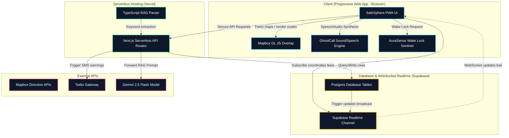

# SafeSphere — Architecture Overview

SafeSphere is engineered as a modern, serverless **Next.js 16 (App Router)** Progressive Web Application (PWA) backed by **Supabase** (Postgres database and Realtime WebSocket engine). 

By integrating all layers into a single monorepo, we eliminated the overhead of separate client bundles, Express APIs, and Python processes, enabling zero-config deployment to Vercel.

---

## 🏗️ System Architecture

---

## 📂 Core Component Responsibilities

| Layer / Component | Technology | Responsibility |
|---|---|---|
| **Client UI (PWA)** | Next.js App Router (React 19 + Tailwind v4) | Handles page layout, Mapbox GL JS map navigation, interactive reporting inputs, and local settings. |
| **Serverless API** | Next.js API Handlers (Edge / Node runtimes) | Acts as the security proxy layer. Handles API secrets, sanitizes NLP inputs, dispatches Twilio SMS alerts, and runs RAG queries. |
| **Database & Realtime** | Supabase (PostgreSQL + Realtime Channels) | Stores user records, trusted contacts, incident reports, and active SOS events. Broadcasts updates over WebSockets automatically. |
| **Ambient Companion** | Screen Wake Lock API & Stealth Layout | Forces the device screen to stay active during walks and hides UI coordinates under a blackened powered-off layout to bypass mobile sleep limits. |
| **De-escalation (GhostCall)** | Web Audio API & SpeechSynthesis | Generates ringtones locally via code oscillators and reads out companion phrases to provide zero-cost, discrete de-escalation excuses. |

---

## 🔄 Key Data Flows

### 1. VibeRoute Safety Scoring & Tagging
1.  **Request**: User enters an origin and destination.
2.  **API Handler** (`/api/navigation/route`): Projects routing lines in `[lng, lat]` order and scores safety values based on incident report density and streetlight overlays.
3.  **Vibe Tagging**: Clicking the Mapbox canvas adds a warning marker and prompts the user to select tag keywords, updating local risk caches.

### 2. Anonymous Incident Reporting
1.  **Logging**: User submits a raw safety description text.
2.  **NLP Classifier** (`/api/reports`): Runs a local regex tokenizer to classify category (assault, infrastructure, harassment) and severity (1–5).
3.  **AI Verification Step**: Presents parsed parameters to the user for adjustment before writing to Supabase tables.

### 3. RAG Chat Assistant ("Sahara")
1.  **Prompt**: User enters a query (e.g. *legal rights*).
2.  **Crisis Interceptor**: Evaluates crisis keywords (e.g. *follow me*), auto-triggering SOS alerts.
3.  **RAG Search** (`/api/chat`): Extracts TF-IDF similarity rankings from the local legal manual index database (`rag_store.json`), passes matching paragraphs to Gemini (`gemini-2.5-flash`), and returns cited guidelines.

### 4. Emergency SOS & Live-Tracking
1.  **Panic Trigger**: User presses SOS. A 5-second countdown triggers with alarm siren tones.
2.  **Responders Warning**: API `/api/sos` fires SMS alerts via Twilio containing an unauthenticated tracking link (`/track/[id]`).
3.  **WebSocket Stream**: Sender walks and updates coords inside the `sos_events` table. Supabase automatically broadcasts row updates, allowing responders to see the live path centering on Mapbox instantly.
